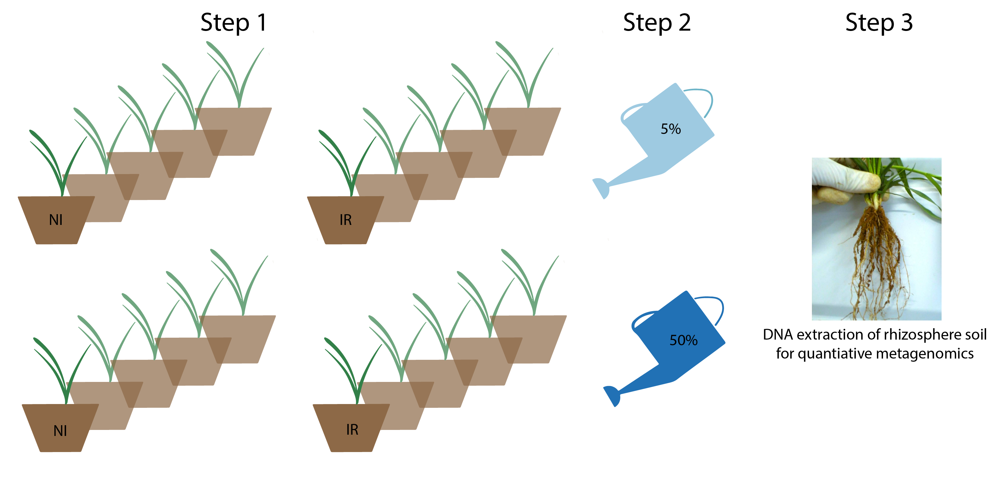

```{css, echo = FALSE}
.tiny .remark-code { /*Change made here*/
  font-size: 50% !important;
}

th { font-size: 12px; }
td { font-size: 12px; }

# b, strong {
#    color: black;
# }

.remark-slide tr:nth-child(2n) {
  background-color: white !important;
}

```

```{r xaringan-themer, include=FALSE, warning=FALSE}
library(xaringanthemer)
library(showtext)
library(data.table)
library(tidyverse)
library(dplyr)
library(plotly)
style_mono_accent(
  base_color = "#66C2A5",
  header_font_google = google_font("Josefin Sans"),
  text_font_google   = google_font("Montserrat", "300", "300i"),
  code_font_google   = google_font("Fira Mono")
)
```


## N in agriculture & recap of N-cycle


- Nitrogen (N) most limiting nutrient for plant growth

- To counteract this problem, N-containing fertilizers are commonly applied 

- Negative effects: atmospheric and groundwater pollution through nitrate leaching and volatilization  

- Linked to soil microbial processes (nitrification and denitrification)  

<br/><br/>
<br/><br/>
<br/><br/>

<font size="1"> Figure source: Nitrification in agricultural soils: impact, actors and mitigation <a href="https://www-sciencedirect-com.erable.inrs.ca:2048/science/article/pii/S0958166917302239#fig0005">(Beeckmann et al., 2018) </a></font> 
 
---

## Nitrification & inhibitors

- First step of nitrification carried out by ammonia oxidizing bacteria and archaea (AOB & AOA)

- Keystone species* ubiquitously found in soil, AOA more abundant than AOB 

- Nitrification inhibitors (e.g. Nitrapyrin) commonly used in combination with N-fertilizers to counteract adverse effects while increasing soil N retention and crop yields

<p align="center">
  
</p>

<font size="1">*A keystone species is a species which has a disproportionately large effect on its natural environment relative to its abundance (source: Wikipedia)</font> 

---

## Nitrapyrin mode of action

- One of the most common nitrification inhibitors 

- Delays nitrification by temporarily deactivating of ammonia monooxygenase (AMO) - enzyme responsible for ammonia oxidation 

- α subunit of AMO is encoded by the amoA gene, which is homologous in AOA and AOB

- Both AOA and AOB could be inhibited by nitrapyrin

<p align="center">
  
</p>

 <font size="1"> Figure source: Nitrification in agricultural soils: impact, actors and mitigation <a href="https://www-sciencedirect-com.erable.inrs.ca:2048/science/article/pii/S0958166917302239#fig0005">(Beeckmann et al., 2018) </a></font> 

---

### What are the effects of nitrapyrin on AOA and AOB?

- Studies found varying effects on AOA and AOB gene abundance (*amoA* gene), AOA:AOB ratio and nitrification rates ([<strong style="color: #66C2A5;">Lehtovirta-Morley et al., 2013</strong>](https://www.nature.com/articles/ismej201542), [<strong style="color: #66C2A5;">Shen et al., 2013</strong>](https://academic.oup.com/femsle/article-lookup/doi/10.1111/1574-6968.12164), [<strong style="color: #66C2A5;">Gu et al., 2018</strong>](https://www.researchgate.net/publication/326259363_Nitrapyrin_affects_the_abundance_of_ammonia_oxidizers_rather_than_community_structure_in_a_yellow_clay_paddy_soil))

- Suggest that nitrapyrin shifts the AOA:AOB ratio, thus inhibiting nitrification at different rates depending on contribution of AOA and AOB to nitrification

- BUT: not known how nitrapyrin affects overall microbial community structure, composition, diversity and functions, and how this varies through the growing season

---

### Nitrapyrin & volatile organic compounds (VOCs)

- VOCs are small compounds (up to C20) with low molecular mass (100–500 Daltons), high vapour pressure, low boiling point and a lipophilic moiety ([<strong style="color: #66C2A5;">Schmidt et al., 2015</strong>](https://www.nature.com/articles/ismej201542))

- Key metabolites in below-ground microbe and plant-microbe interactions & influence important biogeochemical processes (e.g. N-cycle) ([<strong style="color: #66C2A5;">Schmidt et al., 2019</strong>](https://www.nature.com/articles/s41396-019-0469-x?proof=trueSouthampton), [<strong style="color: #66C2A5;">Schulz-Bohm et al., 2017</strong>](https://www.frontiersin.org/articles/10.3389/fmicb.2017.02484/full), [<strong style="color: #66C2A5;">De la Porte et al., 2020</strong>](https://linkinghub.elsevier.com/retrieve/pii/S0966842X20300524))

- Some VOCs (especially monoterpenes) inhibit nitrification (target: AMO)

<p align="center">
  
</p>

 <font size="2"> Patterns of microbial communication across terrestrial ecosystems (Schmidt et al., 2019)</font>

---

## Hypothesis & Objectives 

<strong style="color: #66C2A5;">Hypothesis</strong>: Nitrapyrin-induced shifts in the abundance of the keystone groups AOA and AOB affect the overall microbial community structure, composition, diversity and functions

<strong style="color: #66C2A5;">Objectives</strong>: Explore the effects of nitrapyrin applied on field-grown wheat on 

- overall microbial community structure, composition and diversity

- abundance of genes encoding for enzymes involved in ammonia oxidation, N-fixation, and denitrification 

- microbial VOC emission in the rhizopshere

- the effect of nitrapyrin on the wheat yield and grain quality (tbd)

---

## A field study

<strong style="color: #66C2A5;">Design & setup</strong>: Random block design (6 replicates), wheat seeds (AC Walton) sown in 4 rows on each plot

Fertilizer liquid ammonium nitrate (NH<sub>4</sub>NO<sub>3</sub>) & nitrification inhibitor nitrapyrin (NI) applied twice during the growing season

<p align="center">
  
</p>

---

## Data overview

<strong style="color: #66C2A5;">Treatment</strong>:
- Control (without application of fertilizer + NI)
- NI (wit application of fertilizer + NI)

<strong style="color: #66C2A5;">Sampling date</strong>:
- 2019-07-23 = grain-filling period
- 2019-09-05 = harvest

<strong style="color: #66C2A5;">Compartment</strong>: 
- Bulk soil 
- Rhizosphere soil
---
class: inverse, middle, center

# Diversity, composition and structure of soil microbial communities

---

### Alpha diversity not affected by NI treatment, but by Date & Compartment 

Three-way repeated measures ANOVA of bacterial, archaeal (16S) and fungal (ITS) alpha diversity examined by Shannon index, Inverse Simpson and Faith’s PD

|                                       	|     16S        	|              	|                        	|              	|              	|              	|     ITS        	|                	|                        	|                	|               	|                	|
|---------------------------------------	|----------------	|--------------	|------------------------	|--------------	|--------------	|--------------	|----------------	|----------------	|------------------------	|----------------	|---------------	|----------------	|
|                                       	|     Shannon    	|              	|     Inverse Simpson    	|              	|     PD       	|              	|     Shannon    	|                	|     Inverse Simpson    	|                	|     PD        	|                	|
|                                       	|     *F*          	|     *P*        	|     *F*                  	|     *P*        	|     *F*        	|     *P*        	|     *F*          	|     *P*          	|     *F*                  	|     *P*          	|     *F*         	|     *P*          	|
|     Treatment                         	|     0.001      	|     0.971    	|     0.555              	|     0.461    	|     1.741    	|     0.195    	|     0.588      	|     0.448      	|     0.658              	|     0.422      	|     0.924     	|     0.342      	|
|     Compartment                       	|     0.281      	|     0.599    	|     0.612              	|     0.439    	|     7.977    	|     **0.007**    	|     9.523      	|     **0.004**      	|     17.086             	|     **<0.001**    	|     0.308     	|     0.582      	|
|     Date                              	|     1.175      	|     0.285    	|     0.016              	|     **0.003**    	|     0.378    	|     0.542    	|     49.577     	|     **<0.001**    	|     53.389             	|     **<0.001**    	|     26.062    	|     **<0.001**    	|
|     Treatment × Compartment           	|     0.02       	|     0.888    	|     2.838              	|     0.1      	|     0.121    	|     0.73     	|     1.314      	|     0.258      	|     2.237              	|     0.143      	|     0.74      	|     0.395      	|
|     Treatment × Date                  	|     0.978      	|     0.329    	|     0                  	|     0.997    	|     0.923    	|     0.342    	|     1.492      	|     0.229      	|     0.905              	|     0.347      	|     0.21      	|     0.649      	|
|     Compartment × Date                	|     1.552      	|     0.22     	|     1.273              	|     0.266    	|     2.485    	|     0.123    	|     0          	|     0.989      	|     2.586              	|     0.116      	|     1.434     	|     0.238      	|
|     Treatment × Compartment × Date    	|     0.082      	|     0.777    	|     1.714              	|     0.198    	|     0.345    	|     0.560    	|     0.119      	|     0.732      	|     1.948              	|     0.171      	|     0.416     	|     0.522      	|
---

class: inverse, middle, center

# Time for some interactive graphs!

---

### Increased diversity at the second date (Inv Simpson) & lower diversity in bulk soil (PD) 

Bacterial & archaeal alpha diversity

```{r, message=FALSE, warning=FALSE, echo=FALSE, fig.width=11,fig.height=6}
# load files 
alphabac.dfmelt <- fread(file="/Users/ruthschmidt/Dropbox/Work/INRS/Data/NI_experiment/Files/Interactive_plots/alphabac.df.csv")

# create annotations
y_p2 <- list(
  title = "Inverse Simpson")
y_p3 <- list(
  title = "Phylogenetic Diversity")
x_label <- list(
  title = "Compartment")
# # y_p <- list(
#   title = "Alpha diversity measure")

# annotations
a <- list(
    text = sprintf("20190723                        20190905"),
    font = list(size = 14),
    xref = "paper",
    yref = "paper",
    yanchor = "bottom",
    xanchor = "center",
    align = "center",
    x = 0.5,
    y = 1,
    showarrow = FALSE)

p2 <- alphabac.dfmelt %>% filter(variable == "InvSimpson") %>%
  split(.$Date) %>% lapply(function(d) plot_ly(d, x = ~Compartment, y = ~value, color = ~Treatment,
  colors = "Dark2",
  type = "box",
  legendgroup = ~Treatment,
  showlegend = TRUE)) %>%
  subplot(nrows = 1, shareX = TRUE, shareY =TRUE, titleX = FALSE) %>% layout(boxmode = "group", annotations = a, yaxis = y_p2)

p3 <- alphabac.dfmelt %>% filter(variable == "Phylogenetic Diversity") %>%
  split(.$Date) %>% lapply(function(d) plot_ly(d, x = ~Compartment, y = ~value, color = ~Treatment,
  colors = "Dark2",
  type = "box",
  legendgroup = ~Treatment,
  showlegend = FALSE)) %>%
  subplot(nrows = 1, shareX = TRUE, shareY =TRUE, titleX = FALSE) %>% layout(boxmode = "group", annotations = a, yaxis = y_p3)

p <- subplot(nrows = 1, p2, p3, titleX = TRUE, titleY = TRUE, margin = 0.05) 
## remove unwanted legends from plot
        for (i in seq(3, length(p[["x"]][["data"]]))) {
            p[["x"]][["data"]][[i]][["showlegend"]] <- FALSE
        }
    # show plot
        p
```

---

### Lower diversity in rhizosphere (Shannon & Inv Simpson), and second date (Shannon, Inv Simpson & PD) 

Fungal alpha diversity

```{r, message=FALSE, warning=FALSE, echo=FALSE, fig.width=11,fig.height=6}
# load files 
alphafun.dfmelt <- fread(file="/Users/ruthschmidt/Dropbox/Work/INRS/Data/NI_experiment/Files/Interactive_plots/alphafun.df.csv")

# create annotations
y_p1 <- list(
  title = "Shannon")
y_p2 <- list(
  title = "Inverse Simpson")
y_p3 <- list(
  title = "Phylogenetic Diversity")
x_label <- list(
  title = "Compartment")
# # y_p <- list(
#   title = "Alpha diversity measure")

# annotations
a <- list(
    text = sprintf("20190723          20190905"),
    font = list(size = 14),
    xref = "paper",
    yref = "paper",
    yanchor = "bottom",
    xanchor = "center",
    align = "center",
    x = 0.5,
    y = 1,
    showarrow = FALSE)

p4 <- alphafun.dfmelt %>% filter(variable == "Shannon") %>%
  split(.$Date) %>% lapply(function(d) plot_ly(d, x = ~Compartment, y = ~value, color = ~Treatment,
  colors = "Dark2",
  type = "box",
  legendgroup = ~Treatment,
  showlegend = T)) %>% 
  subplot(nrows = 1, shareX = TRUE, shareY =TRUE, titleX = FALSE) %>% layout(boxmode = "group", yaxis = y_p1, annotations = a, legend=list(title=list(text='Treatment')))

p5 <- alphafun.dfmelt %>% filter(variable == "InvSimpson") %>%
  split(.$Date) %>% lapply(function(d) plot_ly(d, x = ~Compartment, y = ~value, color = ~Treatment,
  colors = "Dark2",
  type = "box",
  legendgroup = ~Treatment,
  showlegend = FALSE)) %>%
  subplot(nrows = 1, shareX = TRUE, shareY =TRUE, titleX = FALSE) %>% layout(boxmode = "group", annotations = a, yaxis = y_p2)

p6 <- alphafun.dfmelt %>% filter(variable == "Phylogenetic Diversity") %>%
  split(.$Date) %>% lapply(function(d) plot_ly(d, x = ~Compartment, y = ~value, color = ~Treatment,
  colors = "Dark2",
  type = "box",
  legendgroup = ~Treatment,
  showlegend = FALSE)) %>%
  subplot(nrows = 1, shareX = TRUE, shareY =TRUE, titleX = FALSE) %>% layout(boxmode = "group", annotations = a, yaxis = y_p3)

p <- subplot(nrows = 1, p4, p5, p6, titleX = TRUE, titleY = TRUE, margin = 0.05) 
## remove unwanted legends from plot
        for (i in seq(3, length(p[["x"]][["data"]]))) {
            p[["x"]][["data"]][[i]][["showlegend"]] <- FALSE
        }
    # show plot
        p

```

---

### Stacked bar charts are not that boring after all (let's have a look at Thaumarchaeota)

Bacterial and archaeal communities (mean relative abundance >1%)

```{r message=FALSE, warning=FALSE, echo=FALSE, fig.width=11,fig.height=6}
# load data 
psbac.df <- fread(file="/Users/ruthschmidt/Dropbox/Work/INRS/Data/NI_experiment/Files/Interactive_plots/psbac.df.csv")

a <- list(
    text = sprintf("20190723 Bulk"),
    font = list(size = 14),
    xref = "paper",
    yref = "paper",
    yanchor = "bottom",
    xanchor = "center",
    align = "center",
    x = 0.5,
    y = 1,
    showarrow = FALSE) 

b <- list(
    text = sprintf("20190905 Bulk"),
    font = list(size = 14),
    xref = "paper",
    yref = "paper",
    yanchor = "bottom",
    xanchor = "center",
    align = "center",
    x = 0.5,
    y = 1,
    showarrow = FALSE) 

c <- list(
    text = sprintf("20190723 Rhizosphere"),
    font = list(size = 14),
    xref = "paper",
    yref = "paper",
    yanchor = "bottom",
    xanchor = "center",
    align = "center",
    x = 0.5,
    y = 1,
    showarrow = FALSE) 

d <- list(
    text = sprintf("20190905 Rhizosphere"),
    font = list(size = 14),
    xref = "paper",
    yref = "paper",
    yanchor = "bottom",
    xanchor = "center",
    align = "center",
    x = 0.5,
    y = 1,
    showarrow = FALSE) 

p1 <- psbac.df %>% mutate(Phylum=fct_reorder(Phylum, Abundance, .fun='mean', .desc=T)) %>% group_by(Phylum) %>% filter(Date == "20190723", Compartment == "Bulk") %>% plot_ly(x = ~Treatment, y = ~Abundance, 
          color = ~Phylum, 
          colors = "Dark2",
          type = "bar", 
           legendgroup = ~Phylum, 
          showlegend = T)  %>%
  layout(barmode = "stack", legend=list(title=list(text='Phylum')), annotations = a, xaxis = list(autorange = "reversed"))

p2 <- psbac.df %>% mutate(Phylum=fct_reorder(Phylum, Abundance, .fun='mean', .desc=T)) %>% group_by(Phylum) %>% filter(Date == "20190905", Compartment == "Bulk") %>% plot_ly(x = ~Treatment, y = ~Abundance, 
          color = ~Phylum, 
          colors = "Dark2",
          type = "bar", 
           legendgroup = ~Phylum, 
          showlegend = F)  %>%
  layout(barmode = "stack", legend=list(title=list(text='Phylum')), annotations = b, xaxis = list(autorange = "reversed"))

p3 <- psbac.df %>% mutate(Phylum=fct_reorder(Phylum, Abundance, .fun='mean', .desc=T)) %>% group_by(Phylum) %>% filter(Date == "20190723", Compartment == "Rhizosphere") %>% plot_ly(x = ~Treatment, y = ~Abundance, 
          color = ~Phylum, 
          colors = "Dark2",
          type = "bar", 
           legendgroup = ~Phylum, 
          showlegend = F)  %>%
  layout(barmode = "stack", legend=list(title=list(text='Phylum')), annotations = c, xaxis = list(autorange = "reversed"))

p4 <- psbac.df %>% mutate(Phylum=fct_reorder(Phylum, Abundance, .fun='mean', .desc=T)) %>% group_by(Phylum) %>% filter(Date == "20190905", Compartment == "Rhizosphere") %>% plot_ly(x = ~Treatment, y = ~Abundance, 
          color = ~Phylum, 
          colors = "Dark2",
          type = "bar", 
           legendgroup = ~Phylum, 
          showlegend = F)  %>%
  layout(barmode = "stack", legend=list(title=list(text='Phylum')), annotations = d, xaxis = list(autorange = "reversed"))

p <- subplot(nrows = 2, p1, p2, p3, p4, titleX = T, titleY = T, shareX = T, shareY = T, margin = 0.05) 
p
```

---
### Most abundant fungal phyum: Mortierellomycota & Ascomycotya (have a look at Basidiomycota)

Fungal communities (mean relative abundance >1%)

```{r message=FALSE, warning=FALSE, echo=FALSE, fig.width=11,fig.height=6}
# load data 
psfun.df <- fread(file="/Users/ruthschmidt/Dropbox/Work/INRS/Data/NI_experiment/Files/Interactive_plots/psfun.df.csv")

a <- list(
    text = sprintf("20190723 Bulk"),
    font = list(size = 14),
    xref = "paper",
    yref = "paper",
    yanchor = "bottom",
    xanchor = "center",
    align = "center",
    x = 0.5,
    y = 1,
    showarrow = FALSE) 

b <- list(
    text = sprintf("20190905 Bulk"),
    font = list(size = 14),
    xref = "paper",
    yref = "paper",
    yanchor = "bottom",
    xanchor = "center",
    align = "center",
    x = 0.5,
    y = 1,
    showarrow = FALSE) 

c <- list(
    text = sprintf("20190723 Rhizosphere"),
    font = list(size = 14),
    xref = "paper",
    yref = "paper",
    yanchor = "bottom",
    xanchor = "center",
    align = "center",
    x = 0.5,
    y = 1,
    showarrow = FALSE) 

d <- list(
    text = sprintf("20190905 Rhizosphere"),
    font = list(size = 14),
    xref = "paper",
    yref = "paper",
    yanchor = "bottom",
    xanchor = "center",
    align = "center",
    x = 0.5,
    y = 1,
    showarrow = FALSE) 

p1 <- psfun.df %>% mutate(Phylum=fct_reorder(Phylum, Abundance, .fun='mean', .desc=T)) %>% group_by(Phylum) %>% filter(Date == "20190723", Compartment == "Bulk") %>% plot_ly(x = ~Treatment, y = ~Abundance, 
          color = ~Phylum, 
          colors = "Dark2",
          type = "bar", 
           legendgroup = ~Phylum, 
          showlegend = T)  %>%
  layout(barmode = "stack", legend=list(title=list(text='Phylum')), annotations = a, xaxis = list(autorange = "reversed"))

p2 <- psfun.df %>% mutate(Phylum=fct_reorder(Phylum, Abundance, .fun='mean', .desc=T)) %>% group_by(Phylum) %>% filter(Date == "20190905", Compartment == "Bulk") %>% plot_ly(x = ~Treatment, y = ~Abundance, 
          color = ~Phylum, 
          colors = "Dark2",
          type = "bar", 
           legendgroup = ~Phylum, 
          showlegend = F)  %>%
  layout(barmode = "stack", legend=list(title=list(text='Phylum')), annotations = b, xaxis = list(autorange = "reversed"))

p3 <- psfun.df %>% mutate(Phylum=fct_reorder(Phylum, Abundance, .fun='mean', .desc=T)) %>% group_by(Phylum) %>% filter(Date == "20190723", Compartment == "Rhizosphere") %>% plot_ly(x = ~Treatment, y = ~Abundance, 
          color = ~Phylum, 
          colors = "Dark2",
          type = "bar", 
           legendgroup = ~Phylum, 
          showlegend = F)  %>%
  layout(barmode = "stack", legend=list(title=list(text='Phylum')), annotations = c, xaxis = list(autorange = "reversed"))

p4 <- psfun.df %>% mutate(Phylum=fct_reorder(Phylum, Abundance, .fun='mean', .desc=T)) %>% group_by(Phylum) %>% filter(Date == "20190905", Compartment == "Rhizosphere") %>% plot_ly(x = ~Treatment, y = ~Abundance, 
          color = ~Phylum, 
          colors = "Dark2",
          type = "bar", 
           legendgroup = ~Phylum, 
          showlegend = F)  %>%
  layout(barmode = "stack", legend=list(title=list(text='Phylum')), annotations = d, xaxis = list(autorange = "reversed"))

p <- subplot(nrows = 2, p1, p2, p3, p4, titleX = T, titleY = T, shareX = T, shareY = T, margin = 0.05) 
p
```

---
### NI treatment affected relative abundance of archaeal phylum Thaumarchaeota, Date & Compartment affected several Phyla

Three-way repeated measures ANOVA of relative abundance of dominant phyla of bacterial & archaeal (16S) communities 

|     16S Phyla             	|     T        	|              	|     C         	|                  	|     D         	|                  	|     T x C    	|              	|     T x D    	|              	|     C x D     	|                  	|     T x C x D    	|              	|
|---------------------------	|--------------	|--------------	|---------------	|------------------	|---------------	|------------------	|--------------	|--------------	|--------------	|--------------	|---------------	|------------------	|------------------	|--------------	|
|                           	|     *F*        	|     *P*        	|     *F*         	|     *P*            	|     *F*         	|     *P*            	|     *F*        	|     *P*        	|     *F*        	|     *P*        	|     *F*         	|     *P*            	|     *F*            	|     *P*        	|
|     **Thaumarchaeota**        	|     4.463    	|     **0.041**    	|     11.899    	|     **0.001**        	|     23.796    	|     **<0.001**    	|     5.845    	|     **0.02**     	|     0.282    	|     0.598    	|     5.301     	|     **0.027**        	|     3.873        	|     0.056    	|
|     Verrucomicrobia       	|     0.216    	|     0.645    	|     3.353     	|     0.075        	|     42.408    	|     **<0.001**    	|     1.456    	|     0.235    	|     2.848    	|     0.099    	|     0.341     	|     0.563        	|     1.353        	|     0.252    	|
|     **Proteobacteria**        	|     2.233    	|     0.143    	|     6.288     	|     **0.016**        	|     2.218     	|     0.144        	|     4.912    	|    **0.032**    	|     0.917    	|     0.344    	|     0.047     	|     0.829        	|     3.643        	|     0.064    	|
|     Actinobacteria        	|     0.571    	|     0.454    	|     1.162     	|     0.288        	|     0.019     	|     0.89         	|     0.581    	|     0.45     	|     0.292    	|     0.592    	|     17.476    	|     **<0.001**    	|     2.934        	|     0.094    	|
|     **Nitrospirae**           	|     0.041    	|     0.841    	|     17.094    	|     **<0.001**    	|     0.067     	|     0.797        	|     0.353    	|     0.556    	|     4.91     	|     **0.032**    	|     1.626     	|     0.21         	|     0.751        	|     0.391    	|
|     Acidobacteria         	|     0.314    	|     0.578    	|     4.703     	|     **0.036**        	|     50.902    	|     **<0.001**    	|     0.095    	|     0.759    	|     0.838    	|     0.366    	|     1.952     	|     0.17         	|     0.001        	|     0.979    	|
|     Firmicutes            	|     0.828    	|     0.368    	|     10.89     	|     **0.002**        	|     75.806    	|     **<0.001**    	|     2.044    	|     0.161    	|     1.378    	|     0.247    	|     19.477    	|     **<0.001**    	|     1.766        	|     0.191    	|
|     Bacteroidetes         	|     1.346    	|     0.253    	|     2.812     	|     0.101        	|     0.548     	|     0.463        	|     2.205    	|     0.145    	|     1.075    	|     0.306    	|     0.127     	|     0.723        	|     1.889        	|     0.177    	|
|     Gemmatimonadetes      	|     1.605    	|     0.213    	|     0.897     	|     0.349        	|     10.954    	|     **0.002**        	|     0.323    	|     0.573    	|     0.386    	|     0.538    	|     1.292     	|     0.262        	|     0.817        	|     0.371    	|

---
### NI treatment increased Thaumarchaeota abundance on first sampling date

Relative abundance of Thaumarchaeota, Proteobacteria & Nitrospirae

```{r message=FALSE, warning=FALSE, echo=FALSE, fig.width=11,fig.height=6}
bactop10p.df <- fread(file="/Users/ruthschmidt/Dropbox/Work/INRS/Data/NI_experiment/Files/Interactive_plots/bactop10p.df.csv")

y_p1 <- list(
  title = "Abundance (Thaumarchaeota)")
y_p2 <- list(
  title = "Abundance (Proteobacteria)")
y_p3 <- list(
  title = "Abundance (Nitrospirae)")

a <- list(
    text = sprintf("20190723         20190905"),
    font = list(size = 14),
    xref = "paper",
    yref = "paper",
    yanchor = "bottom",
    xanchor = "center",
    align = "center",
    x = 0.5,
    y = 1,
    showarrow = FALSE)

# 20190723 16S phylum
p1 <- bactop10p.df %>% filter(Phylum == "Thaumarchaeota") %>% mutate(Phylum=fct_reorder(Phylum, Abundance, .fun='mean', .desc=TRUE)) %>% split(.$Date) %>% lapply(function(d) {
  plot_ly(d, x = ~Compartment, y = ~Abundance, color = ~Treatment,
  colors = "Dark2",
  type = "box",
  legendgroup = ~Treatment,
  showlegend = T) %>% ## include all legends in stored variable
  layout(boxmode = "group", yaxis = list(type = "log"))}) %>%
subplot(nrows = 1, shareX = T, shareY =T, titleX = F, titleY = T, margin = 0.01) %>% layout(boxmode = "group", yaxis = y_p1, annotations = a, legend=list(title=list(text='Treatment')))
## remove unwanted legends from plot
        for (i in seq(3, length(p1[["x"]][["data"]]))) {
            p1[["x"]][["data"]][[i]][["showlegend"]] <- FALSE
        }

p2 <- bactop10p.df %>% filter(Phylum == "Proteobacteria") %>% mutate(Phylum=fct_reorder(Phylum, Abundance, .fun='mean', .desc=TRUE)) %>% split(.$Date) %>% lapply(function(d) {
  plot_ly(d, x = ~Compartment, y = ~Abundance, color = ~Treatment,
  colors = "Dark2",
  type = "box",
  legendgroup = ~Treatment,
  showlegend = F) %>% ## include all legends in stored variable
  layout(boxmode = "group", yaxis = list(type = "log"))}) %>%
subplot(nrows = 1, shareX = T, shareY =T, titleX = F, titleY = F, margin = 0.01) %>% layout(boxmode = "group", yaxis = y_p2, annotations = a, legend=list(title=list(text='Treatment')))
## remove unwanted legends from plot
        for (i in seq(3, length(p1[["x"]][["data"]]))) {
            p2[["x"]][["data"]][[i]][["showlegend"]] <- FALSE
        }

p3 <- bactop10p.df %>% filter(Phylum == "Nitrospirae") %>% mutate(Phylum=fct_reorder(Phylum, Abundance, .fun='mean', .desc=TRUE)) %>% split(.$Date) %>% lapply(function(d) {
  plot_ly(d, x = ~Compartment, y = ~Abundance, color = ~Treatment,
  colors = "Dark2",
  type = "box",
  legendgroup = ~Treatment,
  showlegend = F) %>% ## include all legends in stored variable
  layout(boxmode = "group", yaxis = list(type = "log"))}) %>%
subplot(nrows = 1, shareX = T, shareY =T, titleX = F, titleY = F, margin = 0.01) %>% layout(boxmode = "group", yaxis = y_p3, annotations = a, legend=list(title=list(text='Treatment')))
## remove unwanted legends from plot
        for (i in seq(3, length(p3[["x"]][["data"]]))) {
            p3[["x"]][["data"]][[i]][["showlegend"]] <- FALSE
        }        

        
p <- subplot(nrows = 1,  p1, p2, p3, titleX = T, titleY = T, margin = 0.05) 
p

```

---

### NI treatment affected relative abundance of archaeal genus *Nitrososphaera*

Three-way repeated measures ANOVA of relative abundance of dominant genera of bacterial & archaeal (16S) communities


|     16S   Genera              	|     T        	|                  	|     C         	|                  	|     D         	|                   	|     T x C    	|                  	|     T x D    	|              	|     C x D     	|                   	|     T x C x D    	|                  	|
|-------------------------------	|--------------	|------------------	|---------------	|------------------	|---------------	|-------------------	|--------------	|------------------	|--------------	|--------------	|---------------	|-------------------	|------------------	|------------------	|
|                               	|     *F*      	|     *P*          	|     *F*       	|     *P*          	|     *F*       	|     *P*           	|     *F*      	|     *P*          	|     *F*      	|     *P*      	|     *F*       	|     *P*           	|     *F*          	|     *P*          	|
|     *Nitrososphaera*          	|     4.463    	|     **0.041**    	|     11.899    	|     **0.001**    	|     23.796    	|     **<0.001**    	|     5.845    	|     **0.02**     	|     0.282    	|     0.598    	|     5.301     	|     **0.027**     	|     3.873        	|     0.056        	|
|     *Gaiella*                 	|     0.46     	|     0.501        	|     0.022     	|     0.883        	|     2.026     	|     0.162         	|     4.697    	|     **0.036**    	|     0.757    	|     0.39     	|     3.386     	|     0.073         	|     8.954        	|     **0.005**    	|
|     *Gp6*                     	|     0.345    	|     0.561        	|     6.855     	|     **0.012**    	|     40.88     	|     **<0.001**    	|     0.004    	|     0.95         	|     2.253    	|     0.141    	|     2.912     	|     0.096         	|     0.131        	|     0.719        	|
|     *Solirubrobacter*         	|     0.468    	|     0.498        	|     2.183     	|     0.147        	|     0.016     	|     0.899         	|     0.863    	|     0.358        	|     0.202    	|     0.656    	|     20.462    	|     **<0.001**    	|     4.491        	|     **0.04**     	|
|     *Gp16*                    	|     0.067    	|     0.797        	|     2.407     	|     0.129        	|     26.357    	|     **<0.001**    	|     3.064    	|     0.088        	|     0.067    	|     0.797    	|     0.017     	|     0.897         	|     3.673        	|     0.062        	|
|     *Hyphomicrobium*          	|     0.113    	|     0.738        	|     43.124    	|     **<0.001**   	|     23.043    	|     **<0.001**    	|     1.307    	|     0.26         	|     3.194    	|     0.081    	|     40.601    	|     **<0.001**    	|     5.7          	|     **0.022**    	|
|     *Rhodoplanes*             	|     2.332    	|     0.135        	|     11.46     	|     **0.002**    	|     0.956     	|     0.334         	|     4.643    	|     **0.037**    	|     0.069    	|     0.794    	|     15.071    	|     **<0.001**    	|     1.961        	|     0.169        	|
|     *Spartobacteria (gis)*    	|     0.648    	|     0.425        	|     0.667     	|     0.419        	|     64.727    	|     **<0.001**    	|     4.032    	|     0.051        	|     2.008    	|     0.164    	|     1.872     	|     0.179         	|     3.035        	|     0.089        	|
|     *Povalibacter*            	|     0.892    	|     0.351        	|     0.115     	|     0.736        	|     7.337     	|     **0.01**      	|     0.436    	|     0.513        	|     0.054    	|     0.817    	|     0.001     	|     0.974         	|     0.697        	|     0.409        	|
|     *Sphingomonas*            	|     0.043    	|     0.836        	|     9.123     	|     **0.004**    	|     1.466     	|     0.233         	|     3.431    	|     0.071        	|     0.145    	|     0.706    	|     2.996     	|     0.091         	|     4.016        	|     0.052        	|

---

### Interaction effect of NI treatment & Compartment affected relative abundance of fungal phylum Basidiomycota

Three-way repeated measures ANOVA of relative abundance of dominant phyla of fungal (ITS) communities

|     ITS   Phyla           	|     T        	|              	|     C        	|              	|     D         	|                   	|     T x C    	|                 	|     T x D    	|              	|     C x D    	|                  	|     T x C x D    	|              	|
|---------------------------	|--------------	|--------------	|--------------	|--------------	|---------------	|-------------------	|--------------	|-----------------	|--------------	|--------------	|--------------	|------------------	|------------------	|--------------	|
|                           	|     *F*        	|     *P*        	|     *F*        	|     *P*        	|     *F*         	|     *P*             	|     *F*        	|     *P*           	|     *F*        	|     *P*        	|     *F*        	|     *P*            	|     *F*            	|     *P*        	|
|     Mortierellomycota     	|     0.037    	|     0.849    	|     1.505    	|     0.227    	|     12.566    	|     **0.001**     	|     1.561    	|     0.219       	|     2.924    	|     0.095    	|     7.27     	|     **0.01**     	|     2.407        	|     0.129    	|
|     Ascomycota            	|     0.081    	|     0.777    	|     0.897    	|     0.349    	|     17.854    	|     **<0.001**    	|     2.676    	|     0.11        	|     4.004    	|     0.052    	|     7.177    	|     **0.011**    	|     2.161        	|     0.149    	|
|     **Basidiomycota**         	|     0.044    	|     0.836    	|     2.415    	|     0.128    	|     25.571    	|     ** <0.001**   	|     6.092    	|     **0.018**   	|     3.15     	|     0.084    	|     0.076    	|     0.784        	|     0.675        	|     0.416    	|
|     Blastocladiomycota    	|     1.623    	|     0.21     	|     0.531    	|     0.47     	|     0.564     	|     0.457         	|     0.378    	|     0.542       	|     0.748    	|     0.392    	|     0.995    	|     0.325        	|     1.235        	|     0.273    	|

---
### Relative abundance of Basidiomycota decreased in bulk & rhizosphere in NI treatments

```{r message=FALSE, warning=FALSE, echo=FALSE, fig.width=11,fig.height=6}
funtop10p.df <- fread(file="/Users/ruthschmidt/Dropbox/Work/INRS/Data/NI_experiment/Files/Interactive_plots/funtop10p.df.csv")

y_p1 <- list(
  title = "Abundance (Basidiomycota)")


a <- list(
    text = sprintf("20190723                                                                  20190905"),
    font = list(size = 14),
    xref = "paper",
    yref = "paper",
    yanchor = "bottom",
    xanchor = "center",
    align = "center",
    x = 0.5,
    y = 1,
    showarrow = FALSE)

# 20190723 16S phylum
p1 <- funtop10p.df %>% filter(Phylum == "Basidiomycota") %>% mutate(Phylum=fct_reorder(Phylum, Abundance, .fun='mean', .desc=TRUE)) %>% split(.$Date) %>% lapply(function(d) {
  plot_ly(d, x = ~Compartment, y = ~Abundance, color = ~Treatment,
  colors = "Dark2",
  type = "box",
  legendgroup = ~Treatment,
  showlegend = T) %>% ## include all legends in stored variable
  layout(boxmode = "group", yaxis = list(type = "log"))}) %>%
subplot(nrows = 1, shareX = T, shareY =T, titleX = F, titleY = T, margin = 0.01) %>% layout(boxmode = "group", yaxis = y_p1, annotations = a, legend=list(title=list(text='Treatment')))
## remove unwanted legends from plot
        for (i in seq(3, length(p1[["x"]][["data"]]))) {
            p1[["x"]][["data"]][[i]][["showlegend"]] <- FALSE
        }
p1
```

---
 
### Not NI treatment, but Compartment & Date altered overall structure of bacterial and archaeal & fungal communities


PERMANOVA of bacterial, archaeal (16S) and fungal (ITS) community structure 

|                                       	|     16S      	|              	|     ITS      	|              	|
|---------------------------------------	|--------------	|--------------	|--------------	|--------------	|
|                                       	|     *R<sup>2</sup>*       	|     *P*        	|     *R<sup>2</sup>*       	|     *P*        	|
|     Treatment                         	|     0.019    	|     0.244    	|     0.016    	|     0.422    	|
|     Compartment                       	|     0.05     	|     **0.001**    	|     0.035    	|     **0.020**    	|
|     Date                              	|     0.124    	|     **0.001**    	|     0.187    	|     **0.001**    	|
|     Treatment × Compartment           	|     0.041    	|     **0.004**    	|     0.031    	|     **0.048**    	|
|     Treatment × Date                  	|     0.015    	|     0.464    	|     0.016    	|     0.408    	|
|     Date × Compartment                	|     0.057    	|    **0.002**    	|     0.033    	|     **0.038**   	|
|     Treatment × Date × Compartment    	|     0.036    	|    **0.019**    	|     0.029    	|     0.076    	|
---

### Date separated beteween rhizosphere and bulk soil (16S)

Principal Coordinates Analysis (PCoA) of the bacterial & archaeal (16S) community composition based on Bray-Curtis dissimilarity

<p align="center">
  
</p>

---

### Date separated beteween rhizosphere and bulk soil (ITS)

Principal Coordinates Analysis (PCoA) of the fungal (ITS) community composition based on Bray-Curtis dissimilarity

<p align="center">
  
</p>

---

### Summary (16S&ITS results)

- Nitrapyrin treatment, among strong effect of compartment and sampling date, affected relative abundance of many bacterial, archaeal and fungal taxa (e.g. Proteobacteria, Nitrospirae, Basidiomycota)

  - Proteobacteria contain AOB
  - Nitrospirae (nitrite-oxidizing bacteria often in close association with AOB or AOA)
  - Basidiomycota contain denitrifiers that play key roles in N cycle
  
- Nitrapyrin had significant effects on expected targets, ammonia-oxidizers

  - AOA expected to increase and AOB decrease due to stronger inhibition of AOB
  - AOA *Nitrososphaera* and Thaumarcheota increased
  - BUT: no observed effect for AOB (below detection limit)

---

class: inverse, middle, center

# Abundance of functional genes of the N cycle

---

### Abundances of the N-cycling genes not affected by NI treatment, but strongly affected by Date

Kruskal-Wallis test of abundance of functional genes involved in N cycle

|                      	|     T        	|              	|     C        	|              	|     D         	|                	|     T x C    	|              	|     T x D     	|                	|     C x D     	|                	|     T x C x D    	|                	|
|----------------------	|--------------	|--------------	|--------------	|--------------	|---------------	|----------------	|--------------	|--------------	|---------------	|----------------	|---------------	|----------------	|------------------	|----------------	|
|                      	|     χ²       	|     *P*        	|     χ²       	|     *P*        	|     χ²        	|     *P*          	|     χ²       	|     *P*        	|     χ²        	|     *P*          	|     χ²        	|     *P*          	|     χ²           	|     *P*          	|
|     amoA-AOA         	|     1.021    	|     0.312    	|     1.150    	|     0.284    	|     21.716    	|     **<0.001**    	|     2.205    	|     0.531    	|     22.741    	|     **<0.001**    	|     25.724    	|     **<0.001**    	|     27.049       	|     **<0.001**    	|
|     amoA-AOB         	|     0.435    	|     0.509    	|     0.17     	|     0.68     	|     22.491    	|     **<0.001**    	|     2.24     	|     0.524    	|     22.954    	|     **<0.001**    	|     28.582    	|     **<0.001**    	|     30.816       	|     **<0.001**    	|
|     AOA:AOB ratio    	|     0.188    	|     0.665    	|     0.043    	|     0.837    	|     27.215    	|     **<0.001**    	|     1.71     	|     0.635    	|     27.445    	|     **<0.001**    	|     32.125    	|     **<0.001**    	|     28.16        	|     **<0.001**    	|
|     nirK             	|     0.002    	|     0.962    	|     1.728    	|     0.189    	|     32        	|     **<0.001**    	|     1.774    	|     0.621    	|     32.683    	|     **<0.001**    	|     34.569    	|     **<0.001**    	|     35.624       	|     **<0.001**    	|
|     nirS             	|     0.051    	|     0.821    	|     2.521    	|     0.112    	|     14.551    	|     **<0.001**    	|     4.314    	|     0.23     	|     19.38     	|     **<0.001**    	|     21.324    	|     **<0.001**    	|     28.16        	|     **<0.001**    	|
|     nifH             	|     1.734    	|     0.188    	|     0.322    	|     0.57     	|     32.87     	|     **<0.001**    	|     2.121    	|     0.548    	|     36.287    	|     **<0.001**    	|     33.454    	|     **<0.001**    	|     37.265       	|     **<0.001**    	|

---

### Abundance of *amoA*-AOA, *nirK*, *nifH* & *nirS* increased, while *amoA*-AOB decreased over time

<p align="center">
  
</p>

---

## Summary (qPCR results)

- Shift (increase) in relative abundance of AOA phyla and genera confirmed by qPCR of archaeal *amoA* gene (dependent on sampling date)

- Similar trends (decrease) observed for AOB *amoA* gene abundance in rhizosphere, suggesting weak efficiency of nitrapyrin on target group

- AOA:AOB ratios >1 (soils low in AOB)

- Sampling date was overarching factor affecting abundance of all N-cycle genes, with stronger effects on first sampling date (limited residence time in soil)

---

class: inverse, middle, center

# Volatile organic compound (VOC) profiles  
---

### Before we dive into the results, let's have a glimpse at the metabolomics data 

Metabolomics data structure after normalization 

.tiny[
```{r echo=TRUE}
# glimpse() is like transposed version of print()
# data.table() is an enhanced version of read.table (detects sep, colClasses and nrows automatically), e.g. fread()
library(data.table)
mset = data.frame(fread("/Users/ruthschmidt/Dropbox/Work/INRS/Data/NI_experiment/Files/VOC/data_normalized.csv", header=T))
glimpse(mset)
```
]

---

### VOC profiles not affected by NI treatment, but differed among Date

.pull-left[

Principal Component Analysis (PCA) of rhizosphere VOC composition

```{r message=FALSE, warning=FALSE, echo=FALSE, fig.width=6.5,fig.height=5}
library(plotly)
pca = read.table("/Users/ruthschmidt/Dropbox/Work/INRS/Data/NI_experiment/Files/VOC/pca.df.txt", sep="\t", header=T)
pca$Date = as.factor(pca$Date)
pcoa3d <- plot_ly(pca, x = ~x, y = ~y, z = ~z, color = ~Treatment, colors = "Dark2", text = ~Date, mode = "markers", type = "scatter3d",
               marker = list(symbol = ~as.factor(char), symbols = "Date"))
pcoa3d <- pcoa3d %>% layout(scene = list(xaxis = list(title = 'PC1 (37.1%)'),
                                   yaxis = list(title = 'PC2 (13.3%)'),
                                   zaxis = list(title = 'PC3 (5.7%)')))

pcoa3d

```

]

.pull-right[

PERMANOVA of rhizosphere VOC composition

|                         	|     *R<sup>2* </sup>   	|     *P*         	|
|-------------------------	|------------------------	|-----------------	|
|     Treatment           	|     0.013              	|     0.384       	|
|     Date                	|     0.665              	|     **0.001**   	|
|     Treatment × Date    	|     0.016              	|     0.304       	|

]

---

### Monoterpene α-Pinene most significant compound

.tiny[
```{r, tidy=FALSE, echo=TRUE}
# DT(): R data objects (matrices or data frames) can be displayed as tables on HTML pages, and DataTables provides filtering, 
# pagination, sorting, and many other features in the tables
library(DT)
voc_table <- fread(file="images/voc_table.txt")
DT::datatable(
  voc_table,
  rownames = FALSE,
  extensions = 'FixedColumns',
  fillContainer = FALSE, options = list(pageLength = 8))
```
]

---

### Monoterpene α-Pinene most significant compound in response to Date, with increase over time 

Heatmap of significant VOCs (*P* <0.01) based on Euclidian distance-clustering 

```{r message=FALSE, warning=FALSE, echo=FALSE, fig.width=11.5,fig.height=6}
# heatmap for ANOVA 0.01 and identified compounds with AMDIS
data.norm = data.frame(fread("/Users/ruthschmidt/Dropbox/Work/INRS/Data/NI_experiment/Files/VOC/data_normalized.csv", header=T))

# Get anova file 
aov = data.frame(fread("/Users/ruthschmidt/Dropbox/Work/INRS/Data/NI_experiment/Files/VOC/anova_0.01_cpds_id_final.csv", sep=",", header=T))
# merge and subset data.norm based on aov 
merge.df = merge(aov, data.norm, by ="ID")
merge.df = merge.df[-c(1,3:11)]
# make compounds row names
merge.df = data.frame(merge.df[,-1], row.names=merge.df[,1])
merge.df = as.data.frame(t(merge.df))

# add treatment and date from mapping file 
treat = data.frame(fread("/Users/ruthschmidt/Dropbox/Work/INRS/Data/NI_experiment/Files/VOC/mapping_file.tsv", sep="\t", header=T))
treat = treat[order(treat$ID), ]
treat = data.frame(treat[,-1], row.names=treat[,1])
# combine treat and merge.df and set factors 
heat.df = cbind.data.frame(treat, merge.df)
heat.df$Treatment = as.factor(heat.df$Treatment)
heat.df$Date = as.factor(heat.df$Date)
# sort data based on treatment and date
heat.df = heat.df[order(heat.df$Treatment, heat.df$Date), ]

# plot 
library(heatmaply)
heatmap.cpds = heatmaply(normalize(x = heat.df), #set to heatmaply for interactive heatmap
          Colv = NULL,
          xlab = "Compound ID", #ylab = "Sample ID",
          method = "euclidean",
          margins = c(1, 1),
          # row_dend_left = TRUE,
          # plot_method = "ggplot",
          fontsize_col = 10,
          fontsize_row = 8,
          showticklabels = c(T,T),
          scale_fill_gradient_fun = ggplot2::scale_fill_gradient2(
    low = "#1B9E77", 
    high = "#D95F02",
    midpoint = 0.5,
    limits = c(0, 1)
          ))
          #file = c("heatmap.pdf")) # only saves in workdir
heatmap.cpds
```

---

## Summary (VOC results)

- Contrary to expectations, we did not find significant direct effect of nitrapyrin treatment on VOC profiles (sampling time)

- But VOC profiles clearly differed according to sampling date
 
- α-Pinene (monoterpene) previously shown to inhibit nitrification by targeting the ammonia monooxygenase enzyme - linked to large decrease in AOB *amoA* abundance at the second sampling date?

- AOB might be more susceptible to inhibitory effects of alpha-pinene than AOA

<p style="text-align:center;"></p>

---

## Conclusions

- Results confirm  hypothesis that nitrapyrin alters the relative abundance of non-target bacteria, archaea, fungi and associated nitrogen-cycle functions

- Effects of nitrification inhibitors might be far reaching, but difficult to determine whether shifts caused directly (e.g. off-target toxic effects) or indirectly (through reduced activities of ammonia-oxidizers) 

- Shifts not reflected in VOC profiles of rhizosphere, suggesting that nitrapyrin did not affect soil functionality

- Nitrapyrin affected  abundance of AOA, but positively

- Nitrapyrin effects also constrained by sampling date and by the plant compartment, suggesting interaction with environmental conditions

---
class: center

### A HUGE THANKS TO ALL OF YOU!

<br></br>
<br></br>


---

### Some useful recources

<font size="4"> 

Courses I took: 
- [<strong style="color: #66C2A5;">Cleaning data in R</strong>](https://learn.datacamp.com/courses/cleaning-data-in-r) (Datacamp)
- Udemy data science courses (R, Python) (regular offers)
- [<strong style="color: #66C2A5;">Coursera data science courses</strong>](https://www.coursera.org/specializations/jhu-data-science?aid=true#courses) (audit for free)

Papers I read: 

- [<strong style="color: #66C2A5;">Waste Not, Want Not: Why Rarefying Microbiome Data Is Inadmissible</strong>](https://journals.plos.org/ploscompbiol/article?id=10.1371/journal.pcbi.1003531)
- [<strong style="color: #66C2A5;">Rarefaction, Alpha Diversity, and Statistics</strong>](https://www.frontiersin.org/articles/10.3389/fmicb.2019.02407/full)
- [<strong style="color: #66C2A5;">Normalization and microbial differential abundance strategies depend upon data characteristics</strong>](https://microbiomejournal.biomedcentral.com/articles/10.1186/s40168-017-0237-y)

Documentations:

- Markdown (Presentation R package [<strong style="color: #66C2A5;">xaringan</strong>](https://github.com/yihui/xaringan), [<strong style="color: #66C2A5;">Tutorial</strong>](https://www.markdowntutorial.com/), [<strong style="color: #66C2A5;">Tutorial</strong>Cheat Sheet</strong>](https://rstudio.com/wp-content/uploads/2016/03/rmarkdown-cheatsheet-2.0.pdf?_ga=2.141878454.584902075.1592179904-1367643102.15861999880))
- [<strong style="color: #66C2A5;">Interactive web-based data visualization with R, plotly, and shiny</strong>](https://plotly-r.com/index.html)
- [<strong style="color: #66C2A5;">Plotly (R)</strong>](https://plotly.com/r/)

R packages:

- [<strong style="color: #66C2A5;">phyloseq</strong>](https://joey711.github.io/phyloseq/), microbiome, microbiomeutilities,  [<strong style="color: #66C2A5;">heatmaply</strong>](https://cran.r-project.org/web/packages/heatmaply/vignettes/heatmaply.html), tidyr, dplyr (part of [<strong style="color: #66C2A5;">tidyverse</strong>](https://www.tidyverse.org/)), [<strong style="color: #66C2A5;">data.table</strong>](https://cran.r-project.org/web/packages/data.table/vignettes/datatable-intro.html)

Ask me!

---

class: center

### But most importantly, don't give up! 

... even if the road is difficult


